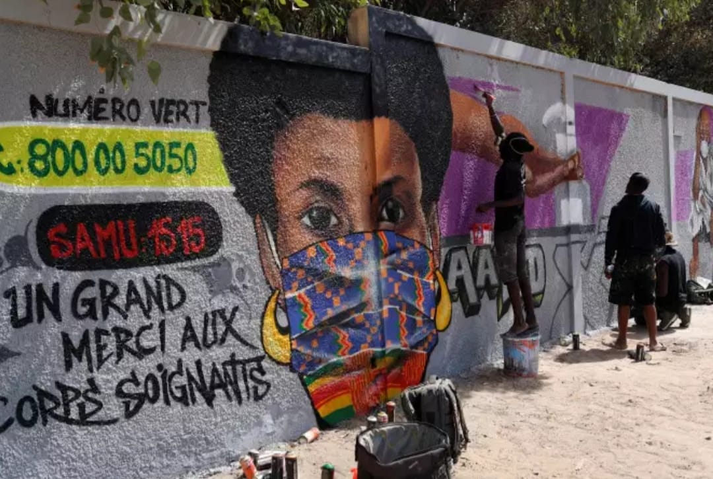

# Masque de soin
Techniques et procédés permettant de créer soi même des masques de soin

A travers cette documentation, nous mettons a votre dispositions toutes les informations nécessaires pour la confections de vos masques de soin. Vous devez savoir qu'il existe un risque de pénurie de masque et aux dernières nouvelles, [l'Etat Français accusait les Américains d'avoir racheté toute leur commande de masque sur leur Tarmac.](https://www.liberation.fr/france/2020/04/01/une-commande-francaise-de-masques-detournee-vers-les-etats-unis-sur-un-tarmac-chinois_1783805)
Fort Heureusement, il existe au Sénégal des entrepreneurs qui ont entrepris de produire eux-mêmes des masques.

## L'origine

## Comment faire son masque

## Les initiatives locales

## Où trouvez un masque

* **Marianne Bathily** - *+221776377431*

* **Castor**
    * **Cheikh Seye** - *+221778946652*
    * **By Tchico** - *+221774260872*
* **VDN**
    * **Marie Mask** - *+221776446498*

* **Parcelles Unité 26**
    * **Ateliers WAYAX** - *+221776026467*
* **Whatsapp**
    * **NABOU CREATION** - *+221776391221*
    * **Dakar Masks** - *+221762008444*

#### Notes et références

Photo graffitis - https://www.igfm.sn/covid-19-au-senegal-des-graffitis-contre-le-coronavirus